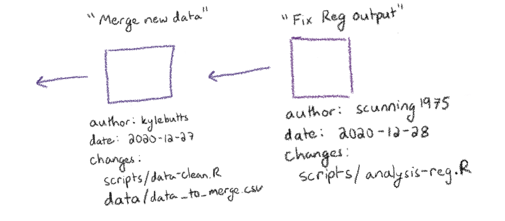
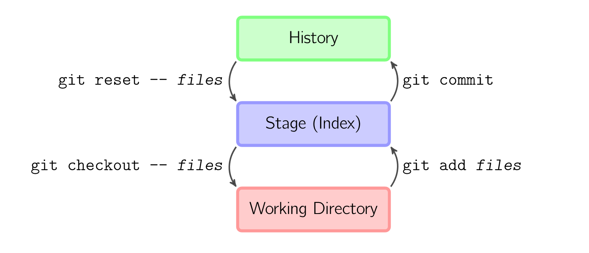
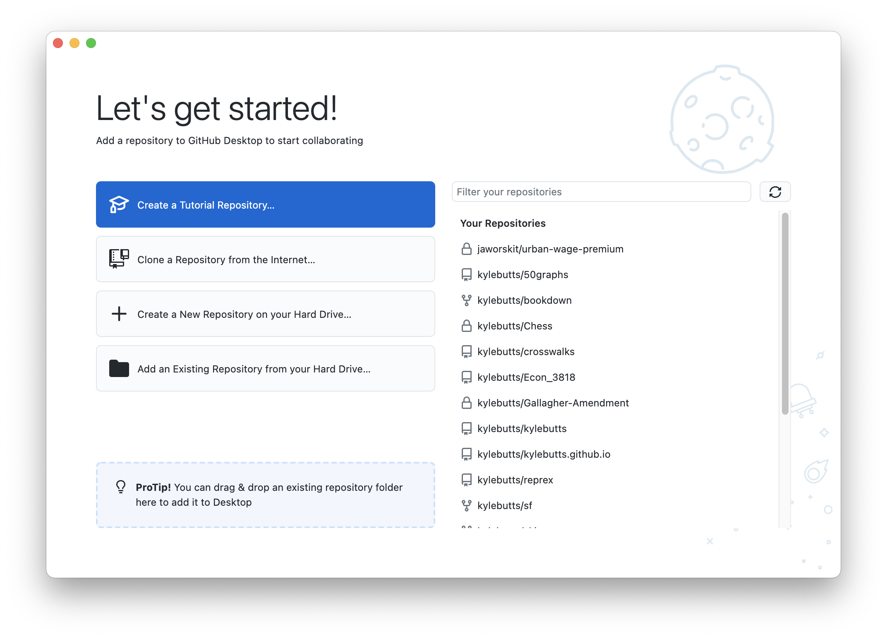
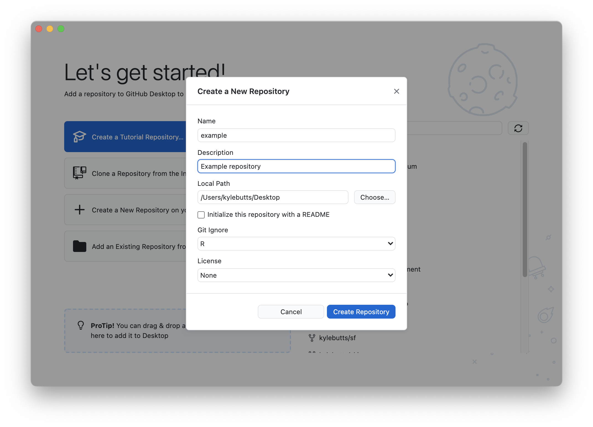
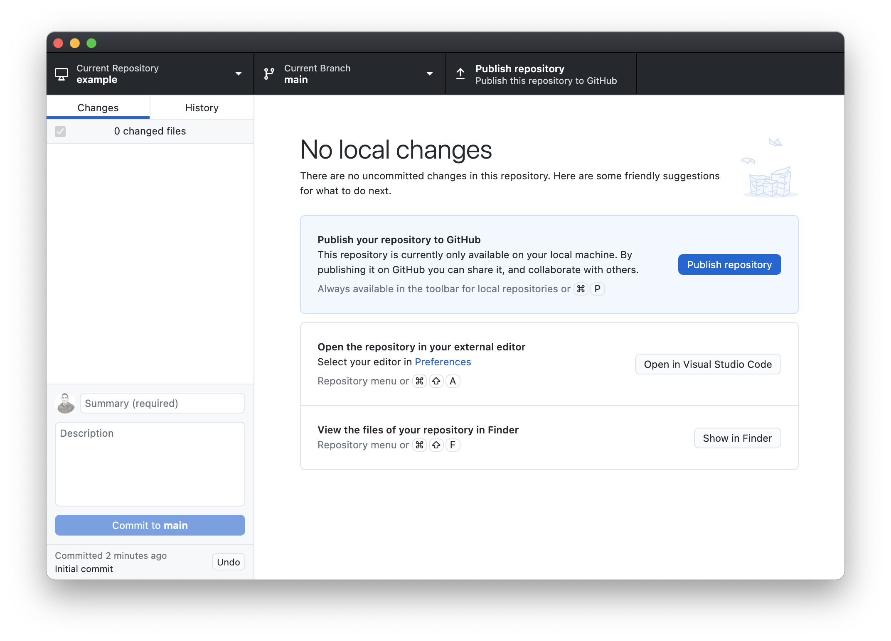
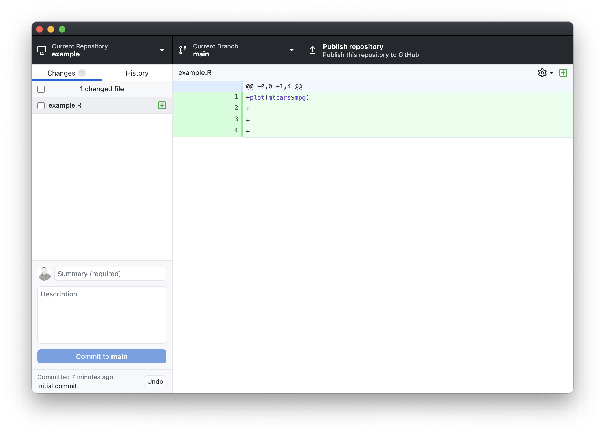
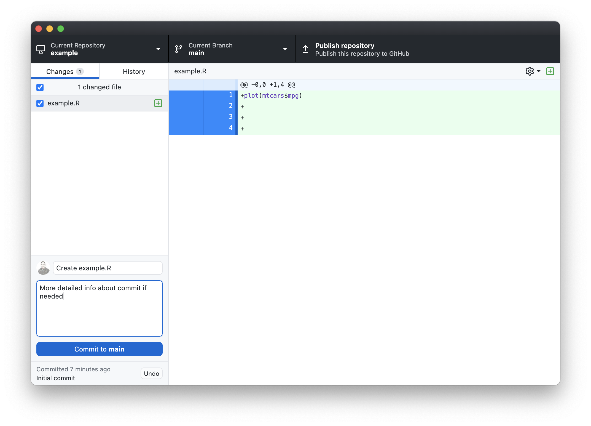
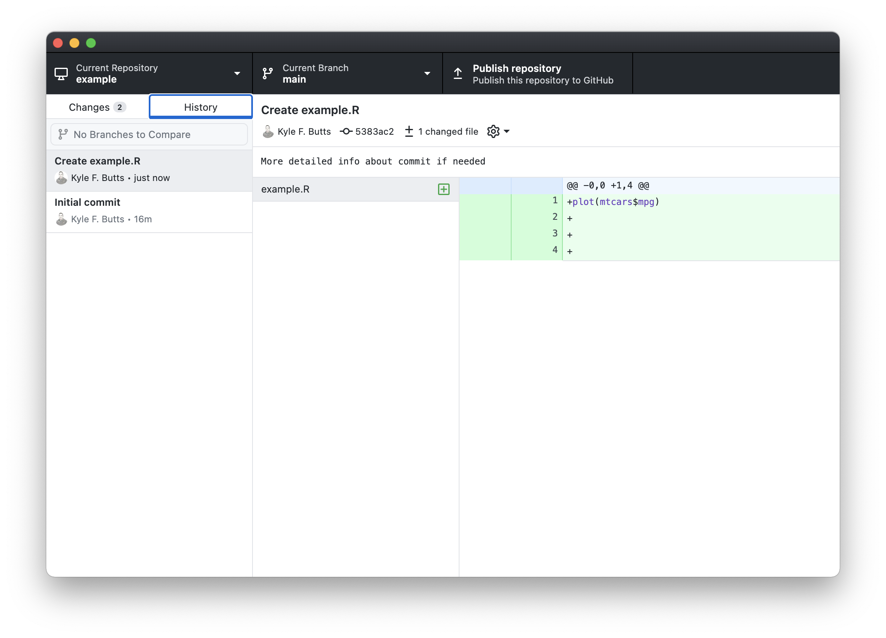
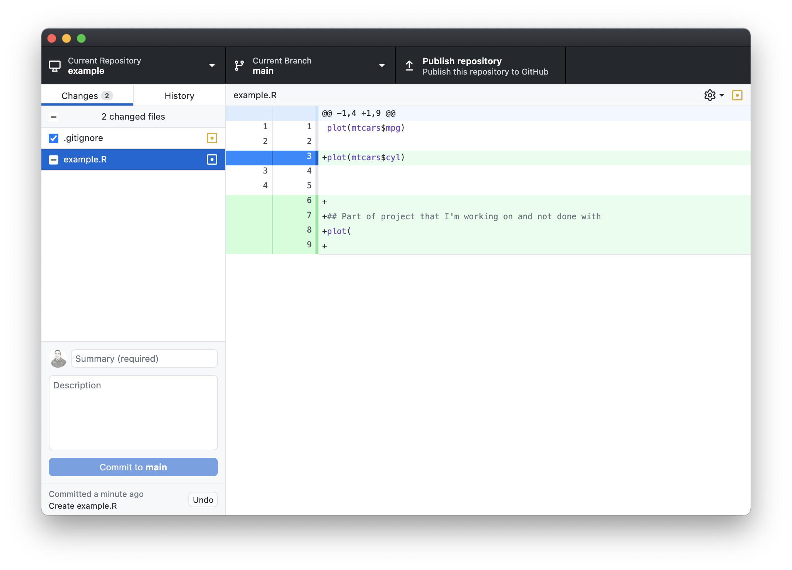

```{r echo=FALSE}
xaringanExtra::use_clipboard()
```

### Git

Imagine each time you make any changes to your project folder, you copied all the files to a new folder and gave it a date and time: 

```{text}
project/ 
└── 2020-12-28_v2/
    ├── scripts/
    │   ├── data-clean.R
    │   └── analysis-reg.R
    └── data/
        ├── main_data.csv
        └── data_to_merge.csv
└── 2020-12-28_v1/
    ├── scripts/
    │   ├── data-clean.R
    │   └── analysis-reg.R
    └── data/
        ├── main_data.csv
        └── data_to_merge.csv
└── 2020-12-27/
    ├── scripts/
    │   ├── data-clean.R
    │   └── analysis-reg.R
    └── data/
        └── main_data.csv
```

---

Things you wish you could do:

- Not use up all your storage in 3 days
- Compare files between versions easily
- Know what you changed in each version
- Be able to undo 'accidents' of all shapes and sizes

`git` will accomplish all four!

Each of these folders will be called a `commit`. 

Version control is just a long string of commits in a row that keep track of all the changes in a project `repository` (`repo` for short).


```{r, echo=F, eval=T}

```


---

`git` workflow


```{r, echo=F, eval=T}

```


- **Working Directory**: 
   - Work as normal, any changes you hit save on end up in the working directory.
- **Stage**: 
   - Changes that you intend to capture in a `commit`, put in the staging area.
- **History**: 
   - When you `commit` you add the saved changes into the history. This history contains all the `commits`.


---
# Learning Git with Github Desktop

Let's create our first git using Github Desktop. All of the git functionality is available via the terminal but point and click is much more user friendly.

To get started need the three following things:

- [Download git](https://git-scm.com/downloads)
- [Download Github Desktop](https://desktop.github.com/)
- [Create Github Acount](https://github.com/)


---
```{r, echo=F, eval=T}

```

---

```{r, echo=F, eval=T}

```

---

```{r, echo=F, eval=T}

```


---
Let's create a file called `example.R` in RStudio and save it to the repository with the following contents

```{r, eval=FALSE}
plot(mtcars$mpg)
```

```{r, echo=F, eval=T}

```


---
To commit changes, select the files you want to commit (or even just subset of lines you want to commit) and type a commit message

```{r, echo=F, eval=T}

```

---
### An aside about commit messages

```{r, echo=F, eval=T}
knitr::include_graphics("graphics/commit_messages_cartoon.png")
```

from https://chris.beams.io/posts/git-commit/.

---

1. The `message` should be equivalent to the subject of the email.
  - Use a verb in the imperative form, e.g. Add, Remove, Fix, Replace, Update, etc.

2. Description area is for more details. You should include *why* you had to make these changes if you're fixing problems. Good messages to yourself can only help.

3. One task per commit. You should not have "Add X regression, Changed Y data, redid Z" all in one commit. 


---
You can view the chain of commits in the History tab


```{r, echo=F, eval=T}

```


---

You can commit particular lines (especially useful if you are working with a large file)

```{r, echo=F, eval=T}

```


---
## What is Github?

Git is all local to your computer. You can be completely offline and still use git.

Github is a website where you can store a cloud version of your repository (either privately or publicly) and where you can collaborate with multiple people.


Simply put: **Git = Word Document; Github = Google Docs**


---
### Example Repository: My templates repository

Let's open an example repository and I'll show you around github: 
https://github.com/kylebutts/templates/


